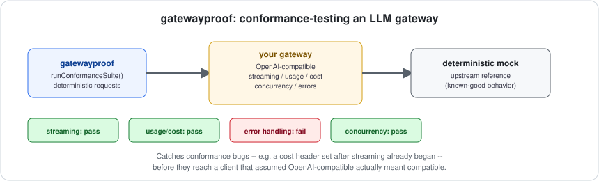

# gatewayproof

[](https://github.com/jayblast-spec/gatewayproof/actions/workflows/ci.yml)
[](https://www.npmjs.com/package/gatewayproof)
[](./LICENSE)



**A conformance test suite for OpenAI-compatible LLM gateways — catches streaming, usage, cost, concurrency, and error-handling bugs that an eyeball review of a diff won't.**

## Background, for anyone new to this

An **LLM gateway** (LiteLLM and its many peers) sits between your application and whichever model provider you're actually calling — OpenAI, Anthropic, a self-hosted model, whatever. Its job is to make all of them look the same to your app: one API shape, provider-agnostic. To do that, on every single request it has to: re-stream the model's response chunk-by-chunk back to you, recompute how many tokens were used, calculate what that request cost, and correctly propagate any upstream failure. That's a surprising amount of stateful, timing-sensitive logic sitting directly in the hot path of every request your app makes — exactly the kind of code that's easy to get subtly wrong.

**Why this is dangerous specifically because it's subtle.** A gateway that drops the last chunk of a streamed response still *looks* like it worked in a quick manual test — you'd have to notice the response was one word shorter than it should be. A gateway that miscalculates cost still returns a number; you'd only notice it was wrong when your bill didn't match your usage. A gateway that swallows an upstream error and reports `finish_reason: "stop"` anyway looks, to your application, exactly like a successful, complete response. None of these announce themselves. They show up in production, under load, as a wrong invoice or a user complaining about a truncated answer nobody can reproduce on demand.

There was no independent, reusable way to check for this class of bug before deploying a gateway (or a change to one). Every project either trusted the gateway's own test suite or found out the hard way. `gatewayproof` is a standalone answer: a deterministic mock model, and a battery of checks any OpenAI-compatible gateway can be run against.

## How it works

You can't point this at a random live gateway and expect a useful answer, because there's no ground truth to compare against when the actual model is involved — you don't know in advance what a real LLM "should" say. Instead:

1. `gatewayproof` starts a **mock upstream** that speaks the same `/v1/chat/completions` API a real provider would, but every response is scripted ahead of time: you (or the checks) tell it exactly what content, token usage, and timing to produce for a given request. This is the "ground truth."
2. **You configure the gateway you're testing** to use that mock upstream's URL as its own upstream provider — the same way you'd normally point it at `api.openai.com`.
3. `gatewayproof` sends requests **through your gateway**, not directly to the mock, and compares what comes back against the ground truth the mock scripted — catching anything the gateway added, dropped, or miscalculated on the way through.

```
  gatewayproof checks  ──requests──>  [ gateway under test ]  ──requests──>  mock upstream (ground truth)
                       <──responses──                         <──responses──
```

## The five checks, and the specific bug each one exists to catch

| Check | The bug it catches |
|---|---|
| `streaming-fidelity` | A dropped, duplicated, or reordered chunk mid-stream — the streamed response, reassembled, doesn't match what a non-streamed call to the same request would return. |
| `usage-accuracy` | Wrong `prompt_tokens` / `completion_tokens` / `total_tokens`, in either a streamed final chunk or a non-streamed response body. |
| `cost-accuracy` | A wrong cost calculation. Reads whatever the gateway reports as cost (defaults to LiteLLM's `x-litellm-response-cost` header, pluggable for others) and checks it against `usage × your pricing table`. |
| `concurrent-isolation` | Content from one concurrent request leaking into another's stream — a real bug class in gateways that multiplex several streams over shared internal state. |
| `error-propagation` | The single worst failure mode: an upstream error mid-stream getting reported to the caller as a clean `finish_reason: "stop"`, which looks exactly like success. |

Every check is independent, so a gateway can fail one without failing the others — the report tells you specifically which promise was broken.

## Quickstart (CLI)

```bash
# 1. Pick a fixed local port and configure your gateway's upstream to point at it
#    (e.g. http://127.0.0.1:5055) -- then start your gateway.
# 2. Run the suite. It starts the mock upstream on that exact port, then hits your gateway.
npx gatewayproof run --target http://localhost:4000 --mock-port 5055
```

```
Mock upstream: http://127.0.0.1:5055
Target gateway: http://localhost:4000

PASS  streaming-fidelity -- Streamed content matches non-streamed content, with no drops, dupes, or reordering
PASS  usage-accuracy -- Reported token usage matches the upstream's actual usage
FAIL  cost-accuracy -- Reported cost matches usage x the supplied pricing table
      expected cost 0.00019999999999999998, got 0.000001
PASS  concurrent-isolation -- Concurrent streamed requests never leak content across streams
PASS  error-propagation -- A mid-stream upstream failure surfaces as an error, never a silently-truncated success

4/5 checks passed.
```

Exit code `0` on all-pass, `1` otherwise.

## Use it as a GitHub Action

```yaml
- name: Start your gateway
  run: |
    # your gateway, configured with upstream = http://127.0.0.1:5055
    my-gateway serve --port 4000 &
    sleep 2

- name: Run gatewayproof against it
  uses: jayblast-spec/gatewayproof@main
  with:
    target: http://localhost:4000
    mock-port: '5055'
```

## Quickstart (library)

For a self-contained test where you control the gateway's lifecycle directly (e.g. testing your own gateway's code in its own test suite):

```ts
import { startMockUpstream, runChecks } from "gatewayproof";

const mock = await startMockUpstream(5055); // fixed port your gateway is already configured against
const gateway = await startMyGateway({ upstreamUrl: mock.url });

const report = await runChecks({ targetBaseUrl: gateway.url, mock });
console.log(report.passed, report.results);

await gateway.stop();
await mock.stop();
```

## Install

```bash
npm install --save-dev gatewayproof
```

## Not in v1, and why

- **Not a load-testing or benchmarking tool.** It checks correctness under a handful of scripted, deterministic scenarios — not throughput, latency, or behavior under real load. Those are different, valuable, and out of scope here.
- **Not a fuzzer.** Every check uses a fixed, hand-designed script rather than randomized inputs. Randomized/property-based scripting is a reasonable v2 direction, not something v1 tried to half-do.
- **Doesn't cover provider-specific features** (function calling, vision inputs, etc.) yet — it covers the chat-completions streaming/usage/cost surface every OpenAI-compatible gateway shares, which is also where the highest-consequence, hardest-to-notice bugs tend to live.

## Development

```bash
npm install
npm run typecheck
npm test
npm run build
npx tsx examples/demo.ts   # runs the suite against a correct fixture and a deliberately buggy one
```

## License

MIT
